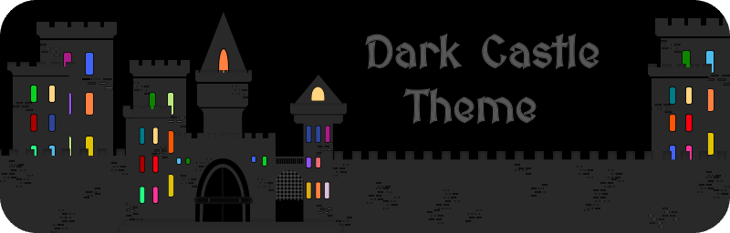

<!-- Begin README -->

<h1 align="left">Hi, I'm Scott aka Griv 
</h1>

I'm a Software Engineer & Architect who is always learning new languages, frameworks, databases, and technologies to solve problems in a creative fashion.

- I enjoy exploring various disciplines to find innovative solutions for my projects.
- I'm passionate about clean code, architecture, enterprise solutions, full-stack development, and UX/UI; I handle all of my own design work, blending technology with my artistic style.
- I actively contribute to the open source community here on GitHub, assist developers on [Stack Overflow](https://stackoverflow.com/users/3092847), and write about technology on [Medium](https://medium.com/@scottgrivner) and [X](https://x.com/scottgrivner).
- For learn more about me, visit my [Portfolio](https://scottgrivner.dev) and [Business](https://nightowllabs.io) websites. Thanks for stopping by!

<h2 align="center"><b>Check out my projects!</b></h2>

    
    
    
    
    
    
    
    
    
    

<h2 align="center"><b>Check out my latest articles on Medium</b></h2>

    

<h2 align="center"><b>Check out my socials and other content!</b></h2>

    &nbsp;&nbsp;
    &nbsp;&nbsp;
    &nbsp;&nbsp;
    &nbsp;&nbsp;
    &nbsp;&nbsp;
    &nbsp;&nbsp;
    &nbsp;&nbsp;

<h3 align="center"><b>I couldn't categorize my GitHub projects, so I made a system to do it for me:</b></h3>

    

<!-- End README -->
