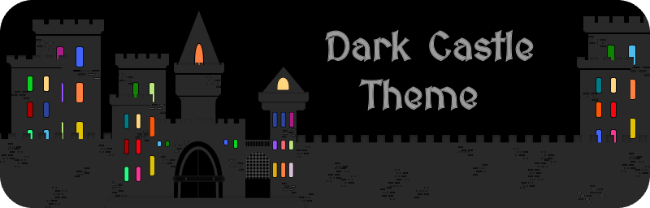

<!-- Begin README -->

<h1 align="left">Hi, I'm Scott aka Griv </h1>
<!-- </h1>-->

I'm a **Technologist** passionate about crafting *innovative, clean, and user-focused* solutions. 

I blend technology with artistic design, explore diverse disciplines, [write about my experiences](https://medium.com/@scottgrivner), and contribute to [open source](https://github.com/scottgriv?tab=repositories) and [developer communities](https://stackoverflow.com/users/3092847). 

Thanks for visiting! Feel free to reach out if you have any questions about my work.

<h2 align="center">Projects</h2>

    
    
    
    
    
    
    
    
    
    

<h2 align="center">Socials</h2>

    &nbsp;&nbsp;

<h3 align="center">I couldn't categorize my projects here on GitHub, so I made a system to do it for me:</h3>

    

<!-- End README -->
