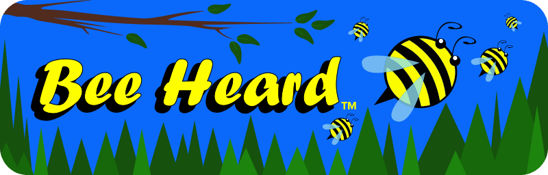

<!-- Begin README -->

# Hi, I'm Scott aka Griv 👋 

I'm a Software Engineer, Architect, Designer, and Educator.

- I'm constantly learning new languages, frameworks, approaches, and technologies to solve problems in new and creative ways.
- I enjoy traversing across multiple disciplines and fields (inside and outside of Computer Science) to come up with creative solutions with my projects.
- I'm passionate not only about clean code and architecture but also about the overall User Experience (UX) and User Interface (UI) of my projects; I do all of my own design work and my favorite part of what I do is combining technology with art.
- Additionally, I actively contribute to the open source community on [GitHub](https://github.com/scottgriv), help fellow developers solve technical problems on [Stack Overflow](https://stackoverflow.com/users/3092847), and educate others about technology around the Web.

<h2 align="center"><b>Check out my projects!</b></h2>

    
    
    
    
    
    
    
    

<h2 align="center"><b>Check out my other content!</b></h2>

    
    
    
    
    
    
    

<h4 align="center"><b>Please consider supporting me if my Software has been beneficial to you!</b></h3>

<h4 align="center"><b>I couldn't categorize my GitHub projects, so I made a system to do it for me:</b></h3>

    

    

<!-- End README -->
